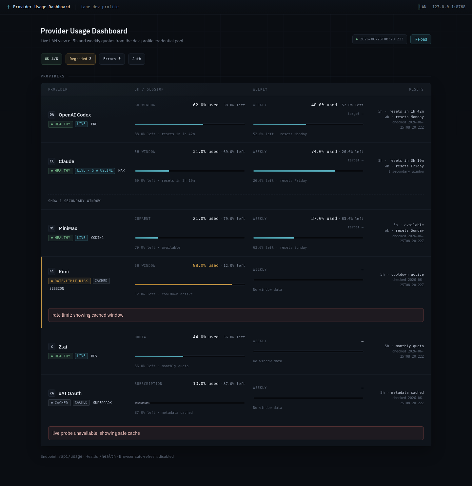

# Provider Usage Dashboard



Local-first web dashboard for tracking AI provider quota, plan, and usage-window state from the credential files already present on a developer machine.

The project is public, but the running dashboard is intentionally **not** a public web service. It can read and refresh OAuth/API credentials, so it should stay on loopback, VPN, or a trusted LAN.

## Current state

- **Runtime:** single-file Python app using only the Python standard library.
- **UI:** static HTML/CSS/JavaScript served by `app.py`.
- **API:** normalized JSON from `/api/usage` plus `/health`.
- **Default bind:** `127.0.0.1:8768`.
- **LAN access:** opt-in with `--host 0.0.0.0` or `host: 0.0.0.0` in a private config.
- **Credential model:** reads local credential files; does not require credentials to be committed.
- **CI:** GitHub Actions `test` job runs on a self-hosted Linux runner labeled `net-github-runner`.
- **Main branch policy:** changes to `main` require a PR and a passing `test` check; direct pushes, deletion, and non-fast-forward updates are blocked by a GitHub ruleset.

## What it shows

The dashboard collects provider-specific responses and normalizes them into provider cards with:

- provider status (`ok`, degraded/auth/rate-limit states, or error)
- account/plan metadata when providers expose it
- current session/day/week/month windows where available
- percent used / percent remaining
- reset timing and lightweight pacing markers
- stale/cache fallback information when a live provider probe cannot complete

The `/api/usage` payload deliberately omits credential file paths and secret values. It contains normalized provider results, host/port, timestamps, and summary counts.

## Supported providers

| Provider | Source | Notes |
| --- | --- | --- |
| MiniMax | API key / Hermes-style credential pool | Coding-plan remain data. |
| Z.ai | API key / Hermes-style credential pool | Quota and recent model-usage probes. |
| OpenAI Codex | OAuth credential entries | Uses Codex/ChatGPT usage endpoints and OAuth refresh support. |
| Anthropic Claude | OAuth credential entries + optional Claude Code statusline fallback | Merges API usage with Claude Code statusline windows when useful. |
| Kimi Code | Kimi credential JSON or `KIMI_AUTH_TOKEN` | Session/usage data with refresh support where credentials allow it. |
| xAI / Grok | OAuth credential resolver + Grok usage UI API | Shared weekly pool percentage/reset plus subscription metadata; safely falls back if the undocumented UI endpoint changes. |

Provider APIs change. The dashboard is best treated as a practical local operator view, not a stable billing ledger.

The xAI weekly meter is the shared Grok subscription pool documented for Chat, Imagine, Voice, Build, and related products. It is separate from xAI API-team billing analytics. See [`docs/xai-usage-surface.md`](docs/xai-usage-surface.md) for the endpoint classification, limitations, and evidence.

## Quick start

```bash
git clone https://github.com/mijanx/provider-usage-dashboard.git
cd provider-usage-dashboard
cp config.example.yaml config.yaml
python3 app.py --config config.yaml
# open http://127.0.0.1:8768/
```

One-shot JSON:

```bash
python3 app.py --config config.yaml --dump-json
```

No third-party Python packages are required.

## Configuration

Copy `config.example.yaml` to `config.yaml` and adjust local paths. `config.yaml` is ignored by git and should stay private.

Paths support `~` and environment variables.

Supported keys:

- `host`, `port`
- `auth_path`
- `claude_credentials_path`
- `claude_statusline_path`
- `kimi_credentials_path`
- `cache_path`
- `timeout_seconds`
- `refresh_seconds`

Environment overrides for defaults:

- `PROVIDER_USAGE_AUTH_PATH`
- `PROVIDER_USAGE_CACHE_PATH`
- `CLAUDE_CREDENTIALS_PATH`
- `CLAUDE_STATUSLINE_PATH`
- `KIMI_CREDENTIALS_PATH`

The default auth source assumes a Hermes-style `auth.json` with `credential_pool` entries. If you do not use Hermes, either adapt `AuthStore` or provide an auth JSON with compatible provider entries. See `fixtures/sample-auth.json` for the expected shape.

## Endpoints

| Path | Purpose |
| --- | --- |
| `/` | HTML dashboard. |
| `/api/usage` | Normalized usage JSON. No credential values or credential file paths are returned. |
| `/health` | Basic health response. |

## Security model

This is localhost/trusted-LAN tooling.

Do:

- keep `config.yaml`, `.env`, cache files, OAuth files, API keys, and statusline files out of git
- run on `127.0.0.1` by default
- use VPN or another trusted network boundary before enabling LAN access
- assume provider responses may include account metadata such as email/plan labels

Do not:

- expose a running dashboard to the public internet
- commit real `auth.json`, Claude/Kimi credential files, cache output, or `.env`
- treat the public repository as permission to publish your live dashboard endpoint

Ignored local files include `config.yaml`, `.env`, `cache/`, `tmp/`, and Python bytecode caches.

## systemd user service

Use `provider-usage-dashboard.service` as a template:

```bash
cp provider-usage-dashboard.service ~/.config/systemd/user/
systemctl --user daemon-reload
systemctl --user enable --now provider-usage-dashboard.service
systemctl --user status provider-usage-dashboard.service --no-pager
```

Edit `WorkingDirectory` and `ExecStart` paths before installing if your checkout is not at `%h/projects/AI-Tools/provider-usage-dashboard`.

## Development

Run local verification:

```bash
python3 -m py_compile app.py
python3 -m unittest discover -s tests -v
```

CI runs the same syntax and unit-test checks as the `test` job on the configured self-hosted runner.

`main` is protected by a repository ruleset:

- PR required before update
- `test` status check required
- strict up-to-date-with-base policy enabled
- branch deletion blocked
- non-fast-forward updates blocked
- no bypass actors

## More installation notes

See [docs/INSTALL.md](docs/INSTALL.md).

## License

MIT. See [LICENSE](LICENSE).
